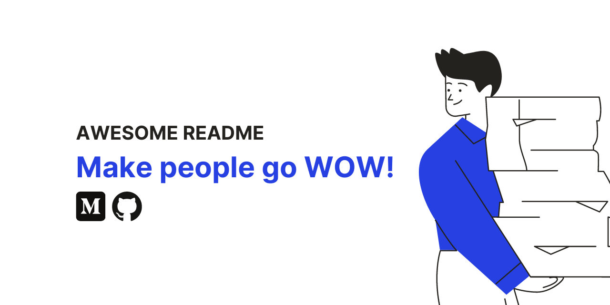

<!-- Add banner here -->

# Project Title (Landing Project)

<!-- Describe project in brief -->
This project aims to give you real-world scenarios of manipulating the DOM.
The functionality you will be using serves two purposes: to prepare you for appending dynamically added data to the DOM, and to show you how javascript can improve the usability of an otherwise static site.
The landing page presents the first opportunity to fully combine your skills in HTML, CSS, and JavaScript into a large project.

## Demo-Preview

## Table of Contents

- [Project Name](#project-title-landing-project)
- [Demo-Preview](#demo-preview)
- [Getting Started](#getting-started)
  - [Introduction](#introduction)
  - [Project Rubric](#project-rubric)
  - [Get the Starter Code](#get-the-starter-code)
- [Usage](#usage)
- [Development](#development)
  - [Instructions](#instructions)
- [Contribute](#contribute)
  - [Adding new features or fixing bugs](#adding-new-features-or-fixing-bugs)
- [License](#license)
- [Udacity Style Guides](#udacity-style-guides)
  - [References]
- [Footer](#footer)
  
## Getting Started

[(Back to top)](#table-of-contents)

### Introduction

  This project requires you to build a multi-section landing page, with a dynamically updating navigational menu based on the amount of content that is added to the page.

### Project Rubric

  [Project Rubric](https://review.udacity.com/#!/rubrics/3601/view)

### Get the Starter Code

- You can download the starter code [here](https://github.com/udacity/cd0428-landing-page/) .
- The starter code has a static, non-interactive version of the project so you can get a jump-start on development!

## Usage

[(Back to top)](#table-of-contents)

Index.html file is where all the changes are visually reflected.
To see the code, please open

- [HTML](index.html), for HTML Code.
- [CSS](css/styles.css), for CSS code.
- [JS](js/app.js), for JavaScript Code.
  
## Development

[(Back to top)](#table-of-contents)

### Instructions

1. Start by linking your **app.js**.

2. **Build out HTML and at least 4 content sections**
   In testing, one more sections was added to check if the navigation menu expands automatically.

3. **Build the navigation menu**
   The navigation menu is dynamically build based on the sections of the page.

4. **Add functionality to distinguish the section in view**
   While navigating through the page, the section that is active in the viewport/closest to the top should be distinguished from the other sections.
   A section that is in the viewport is highlighted by a different color.

5. **Add the functionality to scroll to sections**
   Clicking on a navigation item should scroll to the appropriate section of the page.
   click on a section in the navigation bar triggers soft scroll to anchor ID using scrollTO event.

6. **REFACTOR:**
   When the code is complete, running it through an [eslinter](https://eslint.org/play/) is going to help you get started in refactoring.

7. **Add the functionality to distinguish links in navigation bar**
   Current section in the navigation bar is highlighted on Scroll.

8. Add additional sections to your HTML document. See how the navigation builds.

9. **Test the performance:**
   The performance of your page can be affected by how you write your javascript as well as where you load your javascript.

10. **Responsive landing page:**
   A Responsive layout of the landing page should be created to use across all devices, such as modern desktops, tablets, and phone browsers.
  
11. **Comments:** The project should be properly commented.
   Comments should be present at the beginning of each procedure and class.

12. **README**
    References: [markdown guide](https://www.markdownguide.org/basic-syntax/) and [example of README contents](https://github.com/navendu-pottekkat/awesome-readme/blob/master/README-template.md)

## Contribute

[(Back to top)](#table-of-contents)

### Adding new features or fixing bugs

**Suggested:**

 1. Hide fixed navigation bar while not scrolling (it should still be present on page load).
 2. Hint: setTimeout can be used to check when the user is no longer scrolling.
 3. Add a scroll to the top button on the page that’s only visible when the user scrolls below the fold of the page.
 4. Update/change the design/content.
 5. Make sections collapsible.

## License

[(Back to top)](#table-of-contents)

This program is free software: you can redistribute it and/or modify it under the terms of the GNU General Public License as published by the Free Software Foundation, either version 3 of the License, or any later version.

[License](LICENSE.txt)
[GNU General Public License version 3](https://opensource.org/licenses/GPL-3.0)

## Udacity Style Guides

[(Back to top)](#table-of-contents)

*You should write your code and markup to meet the specifications provided in these style guides:*

 [HTML Style Guide](http://udacity.github.io/frontend-nanodegree-styleguide/index.html)
 [CSS Style Guide](http://udacity.github.io/frontend-nanodegree-styleguide/css.html)
 [JavaScript Style Guide](http://udacity.github.io/frontend-nanodegree-styleguide/javascript.html)
 [Git Style Guide](https://udacity.github.io/git-styleguide/)

### References

*Make sure you are comfortable with the content from the JavaScript and the DOM.*

- [Document](https://developer.mozilla.org/en-US/docs/Web/API/Document).
- [events](https://developer.mozilla.org/en-US/docs/Web/API/Event).
- [addEventListener()](https://developer.mozilla.org/en-US/docs/Web/API/EventTarget/addEventListener).
- [querySelector()](https://developer.mozilla.org/en-US/docs/Web/API/Document/querySelector).
- [querySelectorAll()](https://developer.mozilla.org/en-US/docs/Web/API/Document/querySelectorAll).
- [getElementById()](https://developer.mozilla.org/en-US/docs/Web/API/Document/getElementById).
- [getElementsByClassName()](https://developer.mozilla.org/en-US/docs/Web/API/Document/getElementsByClassName).
- [className](https://developer.mozilla.org/en-US/docs/Web/API/Element/className).
- [classList](https://developer.mozilla.org/en-US/docs/Web/API/Element/classList#Methods).
- [add()](https://developer.mozilla.org/en-US/docs/Web/API/DOMTokenList/add).
- [remove()](https://developer.mozilla.org/en-US/docs/Web/API/DOMTokenList/remove).
- [replace()](https://developer.mozilla.org/en-US/docs/Web/API/DOMTokenList/replace).
- [toggle()](https://developer.mozilla.org/en-US/docs/Web/API/DOMTokenList/toggle).
- [innerHTML](https://developer.mozilla.org/en-US/docs/Web/API/Element/innerHTML).
- [data-*](https://developer.mozilla.org/en-US/docs/Web/HTML/Global_attributes/data-*).
- [The Anchor element](https://developer.mozilla.org/en-US/docs/Web/HTML/Element/a#examples).
- [getBoundingClientRect()](https://developer.mozilla.org/en-US/docs/Web/API/Element/getBoundingClientRect).
- [scrollTo()](https://developer.mozilla.org/en-US/docs/Web/API/Window/scrollTo).
- [scrollIntoView()](https://developer.mozilla.org/en-US/docs/Web/API/Element/scrollIntoView);
- [scroll-behavior](https://developer.mozilla.org/en-US/docs/Web/CSS/scroll-behavior).
- [Template literals (Template strings)](<https://developer.mozilla.org/en-US/docs/Web/JavaScript/Reference/Template_literals>
- [offsetHeight](https://developer.mozilla.org/en-US/docs/Web/API/HTMLElement/offsetHeight)

## Footer

[(Back to top)](#table-of-contents)

### Versions

This is version 2.0 of the Landing Page Project.

Original template is provided by Udacity.
Initial project code © [Element: Udacity]

<!-- Add the footer -->

